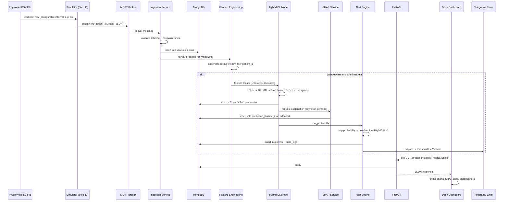
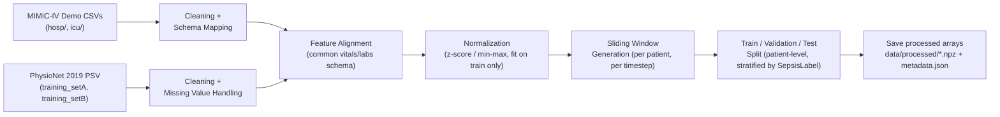

# Data Flow Diagram

## 1. End-to-End Flow (Phase 1, simulated source)

## 2. Preprocessing Data Flow (Step 2, offline/batch)

## 3. Data Origin Traceability

Every document inserted into `vitals` carries a `source` field: `"physionet_sim"`, `"mimic_replay"`, or (Phase 2) `"iot_sensor"`. This field is metadata only — used for filtering/auditing in the dashboard's "Data Source" badge — and **never** used to branch ingestion, feature engineering, model, or alert logic. This is what enables the Phase 2 hardware swap to be additive rather than a rewrite.
