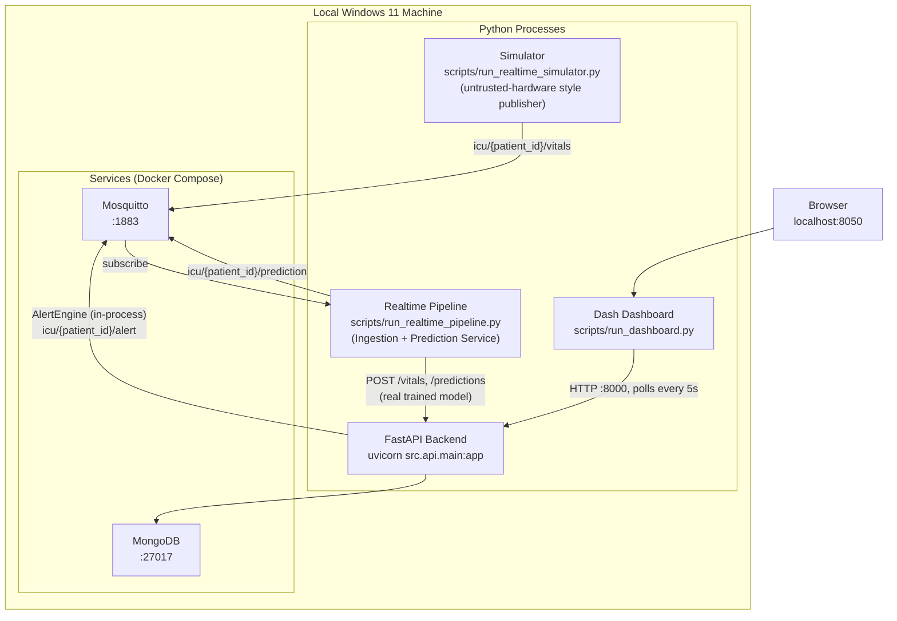

# Deployment Architecture

## 1. Phase 1 as built: Local Development (Windows 11, single machine)

Deliberate simplification vs. the original plan: there is no separate "alert worker" process. `AlertEngine` (`src/alerts/alert_engine.py`) runs **in-process inside the FastAPI request** that creates a prediction (`POST /predictions`) — every prediction, whether it came from a human via the API, the Step 9 seed script, or the Step 11 realtime pipeline, is evaluated for alerting synchronously, right where it's created. This avoids a redundant MQTT consumer, keeps alert latency low, and reuses the request's existing repository/dependency wiring. The dashboard never subscribes to MQTT directly either — it's a pure REST client of the API, polling every 5s, which is simpler to reason about and test than a second real-time transport into the browser.

## 2. Process Inventory (as built)

| Process | Command | Port | Role |
|---|---|---|---|
| MongoDB | `docker compose -f deployment/docker/docker-compose.yml up -d mongo` | 27017 | System of record |
| Mosquitto | `docker compose -f deployment/docker/docker-compose.yml --profile mqtt up -d mosquitto` | 1883 | MQTT broker (Phase 1 simulator ↔ Phase 2 hardware swap boundary) |
| FastAPI backend | `uvicorn src.api.main:app --reload` (or `--host 127.0.0.1 --port 8000`) | 8000 | Single source of truth for all writes; auth; alerting; audit trail |
| Dash dashboard | `python scripts/run_dashboard.py` | 8050 | Clinician-facing UI, REST client of the API only |
| Realtime pipeline | `python scripts/run_realtime_pipeline.py` | n/a (MQTT subscriber + HTTP client) | Ingests `icu/+/vitals`, runs the real model, calls the API |
| Simulator | `python scripts/run_realtime_simulator.py` | n/a (MQTT publisher) | Replays real PhysioNet patients as a live vitals stream |

`deployment/docker/docker-compose.yml` defines `mongo` (always-on) and `mosquitto` (behind the `mqtt` profile, started only when Step 11's realtime pipeline is needed) with named volumes so data persists across restarts. Application processes run natively on the host in Phase 1 for fast iteration; they are containerized only if/when the project moves toward a production-style deployment. See [`docs/installation_guide.md`](../installation_guide.md) for the full startup order.

## 3. Environment Promotion Path (documented now, not built until relevant)

1. **Local dev** (current phase) — everything on one machine, `.env` with localhost URIs.
2. **Phase 2 hardware bench** — ESP32 devices join the same LAN, publish to the same Mosquitto broker (host IP instead of `localhost`); no application-layer changes.
3. **Optional cloud/demo deployment** (out of scope unless requested later) — MongoDB Atlas + a managed MQTT broker + containerized FastAPI/Dash behind a reverse proxy.

## 4. Secrets & Configuration

All secrets (Telegram bot token, SMTP credentials, MongoDB URI if remote, MQTT credentials) live in `.env` (git-ignored). `.env.example` documents required keys with placeholder values.

## 5. Logging & Artifacts on Disk

- `logs/` — structured application logs (rotated).
- `models/checkpoints/` — training checkpoints (`ModelCheckpoint`).
- `models/saved/` — final exported models (`SavedModel` / `.h5`), versioned by filename (`hybrid_v1.keras`).
- `models/logs/` — TensorBoard event files.
