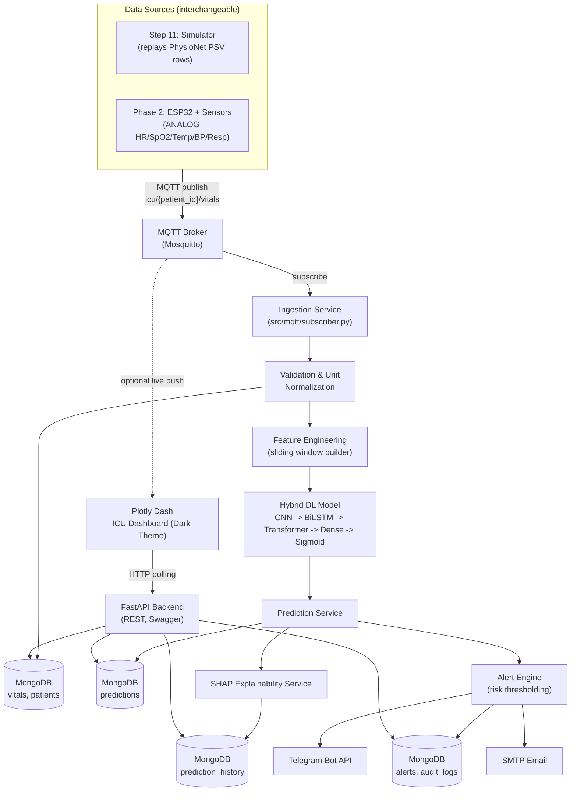

# System Architecture

**Project:** Multi-Modal IoT and Deep Learning Framework for Early Prediction of Sepsis in Smart ICU Environments
**Phase:** 1 — Software Development (hardware-ready, hardware not yet connected)

## 1. Architectural Goals

1. **Modality independence** — the vitals ingestion path must not care whether a reading originated from a replayed PhysioNet record or a physical ESP32 sensor. Both are just "publishers" on the same MQTT contract.
2. **Layer isolation** — Data, Model, Database, API, Dashboard, and Alerting are separate deployable units that only communicate through defined interfaces (MQTT topics, REST APIs, MongoDB collections). No layer reaches into another layer's internals.
3. **Swap-without-rewrite** — replacing the Step 11 simulator with real ESP32 hardware in Phase 2 must require zero changes to `src/models`, `src/api`, `dashboard/`, or `src/database`. Only `src/mqtt` publishers change (simulator publisher → firmware/gateway publisher).
4. **Explainability by default** — every prediction stored in MongoDB carries (or can lazily generate) a SHAP explanation, so the dashboard never predicts without being able to explain.

## 2. High-Level Component Diagram

## 3. Layer Responsibilities

| Layer | Responsibility | Tech |
|---|---|---|
| **Ingestion** | Subscribes to MQTT vitals topics, validates payload schema, normalizes units, writes raw vitals to MongoDB, triggers feature pipeline | Python, `paho-mqtt` |
| **Feature Engineering** | Builds sliding-window multivariate time-series tensors per patient from raw vitals + static features | Pandas, NumPy |
| **Model** | Hybrid CNN → Bi-LSTM → Transformer Encoder → Dense → Sigmoid; produces sepsis-onset probability per window | TensorFlow 2.x |
| **Explainability** | Generates SHAP values (global + per-patient) for each prediction | SHAP, LIME |
| **Persistence** | Stores patients, vitals, predictions, SHAP artifacts, alerts, audit logs | MongoDB |
| **API** | REST endpoints exposing patients, predictions, history, alerts, SHAP, health | FastAPI |
| **Alerting** | Evaluates risk level (Low/Medium/High/Critical) from prediction probability, dispatches to Dashboard/Telegram/Email, logs to `alerts` | Python, `python-telegram-bot`, `smtplib` |
| **Dashboard** | Real-time + historical ICU visualization, SHAP plots, alert center, admin views | Plotly Dash |
| **Simulation (Phase 1 only)** | Replays PhysioNet PSV records at configurable interval, publishes to the same MQTT contract real hardware will use | Python |
| **Hardware Gateway (Phase 2, not built yet)** | ESP32 firmware publishing to identical MQTT topics | C++/Arduino (out of scope for Phase 1) |

## 4. Interface Contracts (the "swap boundary")

The entire hardware-readiness guarantee rests on one contract: **anything that publishes valid JSON to `icu/{patient_id}/vitals` on the MQTT broker is a valid data source.** Documented fully in `mqtt_architecture.md`. Neither the model, the API, the database schema, nor the dashboard queries reference "simulator" or "sensor" — they only reference `source` as a metadata tag (`"physionet_sim"`, `"mimic_replay"`, `"iot_sensor"`) for traceability, never for branching logic.

## 5. Configuration Strategy

A single `src/config/settings.py` (Pydantic `BaseSettings`) reads from `.env`, exposing: MongoDB URI, MQTT broker host/port, model artifact paths, Telegram bot token, SMTP credentials, alert thresholds, simulation interval. No component hardcodes connection details.

## 6. Non-Functional Requirements

- **Latency**: raw vitals → stored prediction under 2s for a single patient window on CPU inference.
- **Testability**: every layer has unit tests that can run with MongoDB/MQTT mocked (`mongomock`, in-process MQTT loopback) — see `testing_strategy.md`.
- **Portability**: all paths are configuration-driven; no absolute Windows paths in source code (dataset roots for MIMIC-IV Demo and PhysioNet 2019 are resolved via `.env`, since they already exist at the project root outside `data/`).
- **Observability**: structured logging (`structlog` or stdlib `logging` with JSON formatter) across ingestion, prediction, and alerting.
